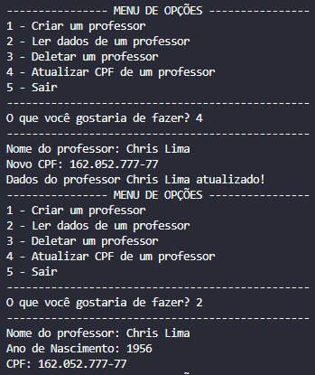

# Exercício Avaliativo 02 - Neo4J

## Respostas da questão 3
2. Utilizando a classe `TeacherCRUD()` crie um `Teacher` com as características informadas anteriormente:

    

3. Utilizando a classe `TeacherCRUD()` pesquise o professor com o name de `"Chris Lima"` .

    

4. Utilizando a classe `TeacherCRUD()` altere o cpf do `“Teacher”` de name `"Chris Lima"` para `"162.052.777-77"` .

    
